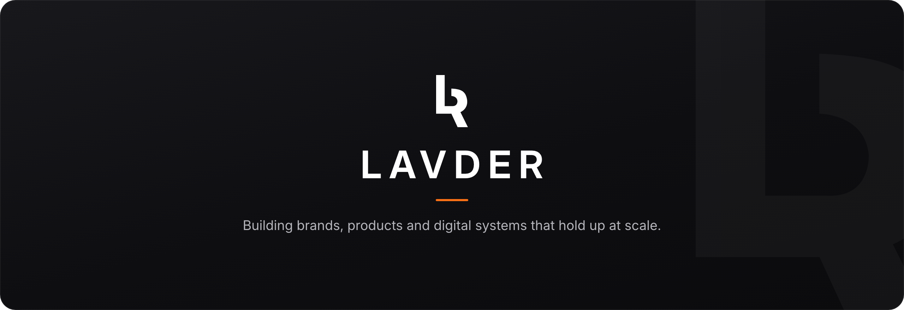

  

  <strong>An international company building brands, products and digital systems.</strong>

  
  &nbsp;
  

 

### What we do

<table>
<tr>
<td width="50%" valign="top">

**Brand &amp; Identity** 
Design systems, identity and voice built to scale.

</td>
<td width="50%" valign="top">

**Web &amp; E-commerce** 
High-performance sites and stores, engineered to convert.

</td>
</tr>
<tr>
<td width="50%" valign="top">

**Product &amp; Platforms** 
Web and native apps, from prototype to production.

</td>
<td width="50%" valign="top">

**AI-native delivery** 
Modern, automated workflows that ship faster without losing craft.

</td>
</tr>
</table>

### Why teams trust us

We work as an embedded partner, not a vendor. One standard of craft across
everything we build, held to the same level whether it serves a small team or a
global audience. Direct communication, senior hands on the work, and results we
stand behind.

 

  <picture>
    <source media="(prefers-color-scheme: dark)" srcset="assets/mark-white.png">
    
  </picture>
    
  <a href="https://lavder.com">lavder.com</a>

