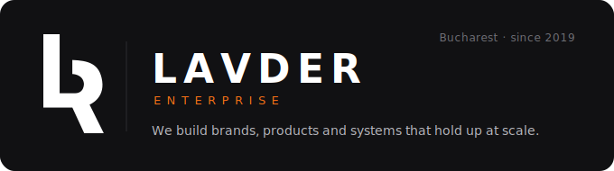

  

<h3 align="center">Più che un'agenzia. Il tuo partner di fiducia.</h3>

---

Lavder Enterprise Srl is a holding company founded in Italy, headquartered in
Bucharest. We build, own, and scale products and service companies that share
one design language, one voice, one level of craft.

### What we build

- **Lavder** — Web & marketing agency. 100+ clients, agencies and partners
  served since 2019. → [lavder.com](https://lavder.com)
- **Dolce** — Custom-cake consumer app.

### How we work

We use the tools of 2026: AI-native delivery, component-driven design systems,
EU AI Act–ready process. We ship sites, platforms and brand systems that hold
up at scale — technically, visually, commercially.

### Open work

- [`lavder-branding`](https://github.com/lavderenterprise/lavder-branding) —
  our brand system: design tokens, LVDR logos, voice, components. One source of truth.

### Contact

[lavder.com](https://lavder.com) · [info@lavder.com](mailto:info@lavder.com)
